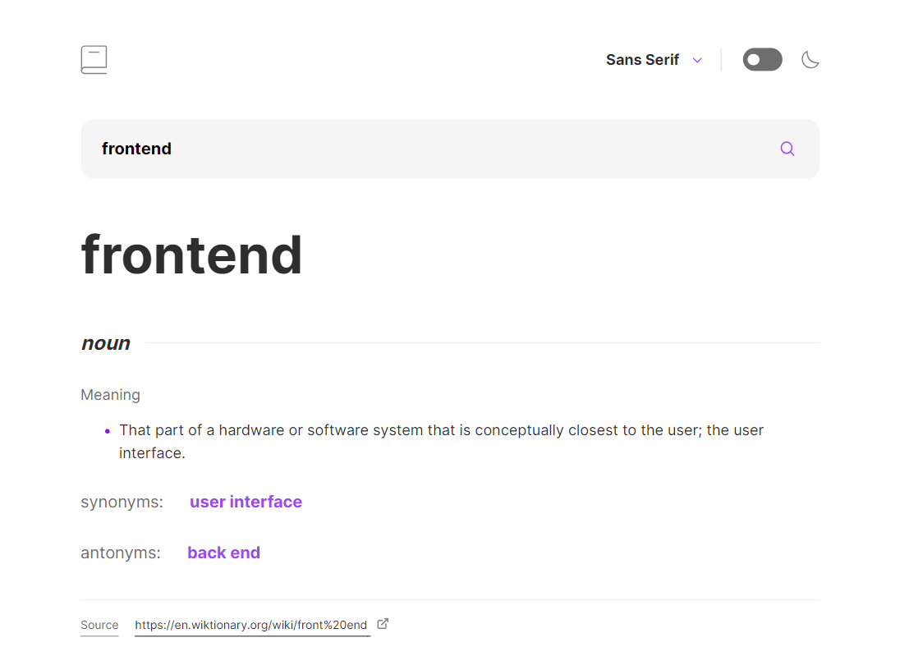

# Dictionary web app

## Table of contents

- [Overview](#overview)
  - [Screenshot](#screenshot)
  - [Links](#links)
- [My process](#my-process)
  - [Built with](#built-with)
  - [What I learned](#what-i-learned)
  - [Useful resources](#useful-resources)
- [Author](#author)
- [Acknowledgments](#acknowledgments)

### Screenshot

## My process

### Built with

- Semantic HTML5 markup
- CSS custom properties
- Flexbox
- CSS Grid
- Mobile-first workflow
- [React](https://reactjs.org/) - JS library
- [Vite](https://vitejs.dev/) - Local dev server & bundler

### What I learned
- Creating a custom drop-down menu 

- Getting data from API via react query 

- Handle cases when API gives both error and data at the same time

- Working with input of search type and its styling

### Useful resources
- [Ibadehin Mojeed](https://blog.logrocket.com/creating-custom-select-dropdown-css/) - An article about creating a custom drop-down menu with accessibility in mind.

## Author
- Linkedin - [daniilgurski18](https://www.frontendmentor.io/profile/DaniilGurski)

## Acknowledgments
- AlexKMarshall
- Grace-Snow 
